# 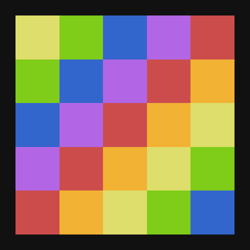 PIXELBOX LITE

### About
***Very fast*** ComputerCraft library used for rendering graphics with teletext characters (\128-\159)

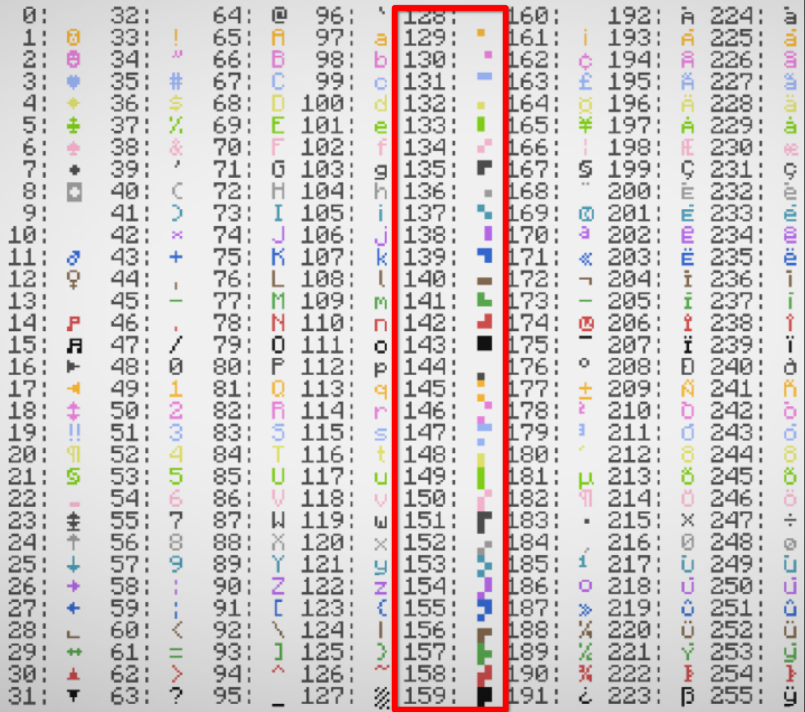

### What is this and why do i need it?
Pixelbox *lite* is a "minimal" library for drawing 2D graphics (color buffers) to the terminal/windows
in CC:T.

Its main objective is to be
- **very fast**
- lightweight (minified fits into under 4kB)
- easy to use/integrate
- flexible (in terms of what you can actually have it do)
- display quality (there are some extra snippets for denoising)

With pixelbox lite you can technically get 6x more pixels out of your terminal, each character can now be a block of 3x2 chars

Here you can see the same terminal resolution (default computer: 51x19 chars) being filled with random colors, without and with pixelbox

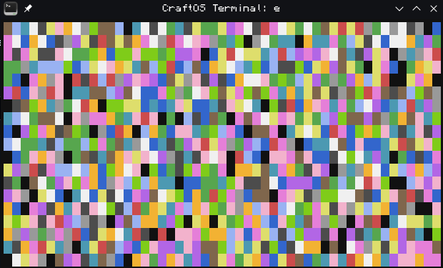
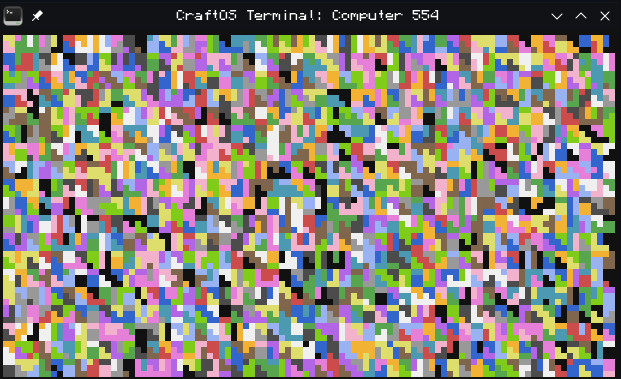

### Installation
Installing is a very simple as its just a singular file
```
wget https://raw.githubusercontent.com/9551-Dev/pixelbox_lite/master/common/pixelbox_lite.lua
```

## Basic usage
As for the usage its pretty simple to get started
- require the api
- use the `new` function to make a `box` object for your desired terminal
- write to its `canvas` property of the box, which is a 2D array (`canvas[y][x] = color`; `color = 2^n; 0<=n<=15`)
- run the render method, and thats it.

Heres an example of how that could look
```lua
local box = require("pixelbox_lite").new(term.current())

-- blue vertical line
box.canvas[5][5] = colors.blue
box.canvas[6][5] = colors.blue
box.canvas[7][5] = colors.blue

-- disconnect on it
box.canvas[6][6] = colors.blue

-- yellow vertical line
box.canvas[5][7] = colors.yellow
box.canvas[6][7] = colors.yellow
box.canvas[7][7] = colors.yellow

-- display to terminal
box:render()
```
Heres what this produces

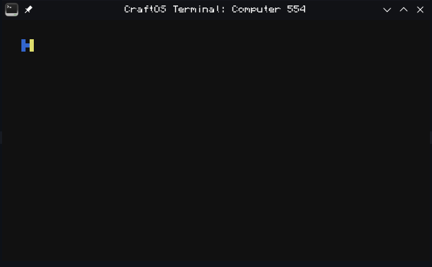

Instead of defining stuff like hand like we did here, how about we use some for loops to make some interesting patterns
```lua
local box = require("pixelbox_lite").new(term.current())

local n,m,scale  = 0.9,7.8,30
local full_color = 15/4

for i=0,15 do local c = i/15 term.setPaletteColor(2^i,c,c,c) end

for y=1,box.height do
    for x=1,box.width do
        box.canvas[y][x] = 2^math.floor(((
            math.sin(n*math.pi*x/scale) *
            math.sin(m*math.pi*y/scale) +
            math.sin(m*math.pi*x/scale) *
            math.sin(n*math.pi*y/scale)
        )*full_color)%15)
    end
end

box:render()

os.pullEvent("char")
for i=0,15 do term.setPaletteColor(2^i,term.nativePaletteColor(2^i)) end
```
Just like this

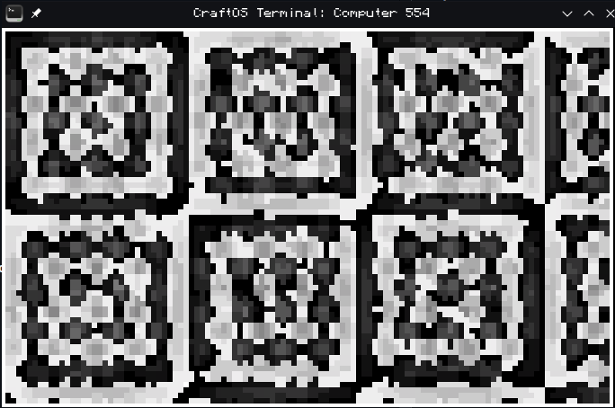

## api functions
Here i will show the functions which are actually under the pixelbox api, to access these you would actually have to make a separate variable for pixelbox like this
```lua
local pixelbox = require("pixelbox")
local box = pixelbox.new(term.current())
...
```
instead of the classic
```lua
local box = require("pixelbox").new(term.current())
```
#### Values
- pixelbox.initialized`[boolean]`: remains false until `pixelbox.new` is ran, used to tell pixelbox when to generate its lookup tables (so they arent generated multiple times)
- pixelbox.license`[license]`: stores pixelbox'es MIT license

#### Methods
- `pixelbox.new(window,[background])`: makes a new `box` object given a window/terminal object and an optional background color, if a color is not given the terminals current `backgroundColor` is used.
- `pixelbox.make_canvas([source_table])`: makes a bare pixelbox canvas, this doesnt contain any values/information yet other than an OoB (Out of Bounds) metatable for handling writes outside of the canvas. Can be populated via `pixelbox.setup_canvas()`. Argument allows you to use any existing table to make the "bare" canvas, it will just attach a metatable.
- `pixelbox.setup_canvas(box,bare_canvas,color)`: makes a canvas fit to be used with a specific `box` object given a box, a bare canvas and a color to fill the background/empty data with
- `pixelbox.restore(box,color,[keep_existing])`: either (depending on keep_existing, true doesnt make a completely freash canvas) gives a `box` object a completely new canvas given a color or completely rewrites existing one (used portion) with a given color

## data
Here i will tell ya a bunch of useful data you can get from the `box` object

#### Values
- box.canvas`[table[y][x]]`: 2D buffer of colors used to tell pixelbox what to draw
- box.CANVAS`[table[y][x]]`: same as canvas. Exists for back compat reasons
- box.term`[window]`: holds the terminal object the box is meant to be rendered to
- box.term_width`[number]`: Width of the terminal being drawn to in characters
- box.term_height`[number]`: Height of the terminal being drawn to in characters
- box.width`[number]`: Width of the terminal being drawn to in "pixels" (term_width*2)
- box.height`[number]`: Height of the terminal being drawn to in "pixels" (term_height*3)
- box.background`[number]`: holds the default background color for when the screen is being cleared

#### Methods
- `box:render()`: has pixelbox process the color buffer (canvas) and write the result to its output window object (box.term)
- `box:clear([color])`: fills the canvas with either a given color or the current `box.background` color if one is not provided or is invalid
- `box:set_pixel(x,y,color)`: function for setting colors in the canvas, i have no idea why you would use this. Essentially box.canvas[y][x] = color
- `box:set_canvas(canvas)`: easily allows you to swap the boxes canvas given one.
- `box:resize(w,h,color)`: recalculates width/height values and rewrites the canvas to a new given size, filling it with a given color or `box.background` if one is not given
- **`box:analyze_buffer()`**: reads all the data in the `canvas` which is meant to be used with the current setting, checks for canvas, scanline, pixel and color value validity, throws an error if something is invalid. **Returns true on all checks passed**

## More complex usage
just to show what you can do, i will take previous H example but setup the canvas completely by hand
```lua
local pixelbox = require("pixelbox_lite")
local box      = pixelbox.new(term.current())

local bare_canvas   = pixelbox.make_canvas()
local usable_canvas = pixelbox.setup_canvas(box,bare_canvas,colors.black)

-- blue vertical line
usable_canvas[5][5] = colors.blue
usable_canvas[6][5] = colors.blue
usable_canvas[7][5] = colors.blue

-- disconnect on it
usable_canvas[6][6] = colors.blue

-- yellow vertical line
usable_canvas[5][7] = colors.yellow
usable_canvas[6][7] = colors.yellow
usable_canvas[7][7] = colors.yellow

box:set_canvas(usable_canvas)
box:render()
```
You could also just use an empty table instead of `pixelbox.make_canvas` but that wont have protection against writing outside of bounds. Thats why i rather recommend passing in a source_table to it

---
## Some stuff made with Pixelbox
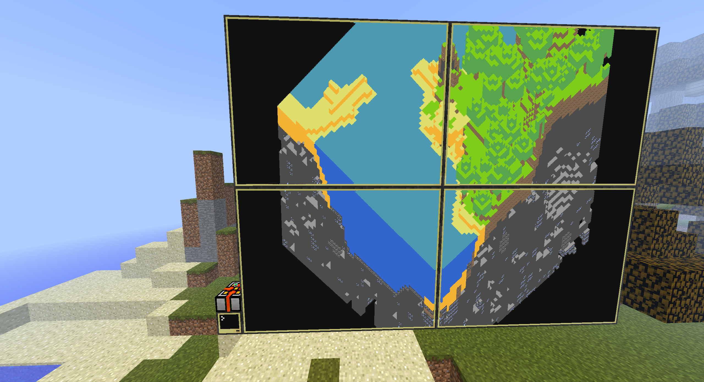
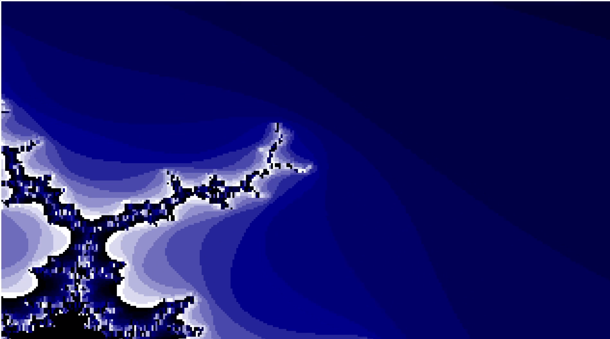
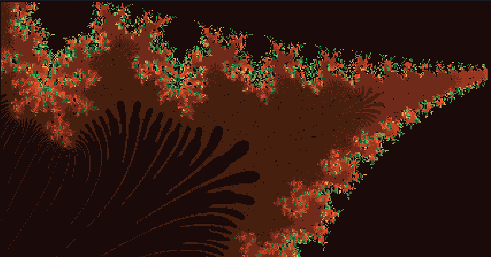
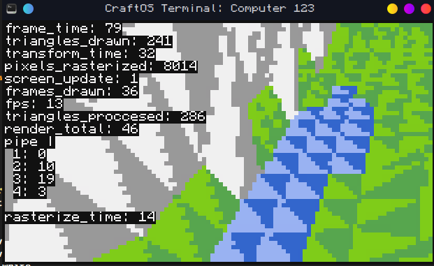
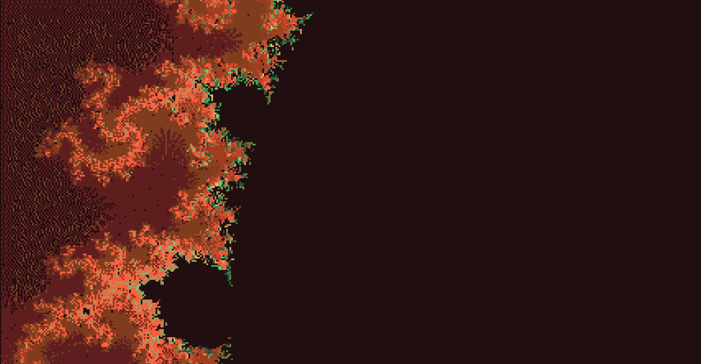
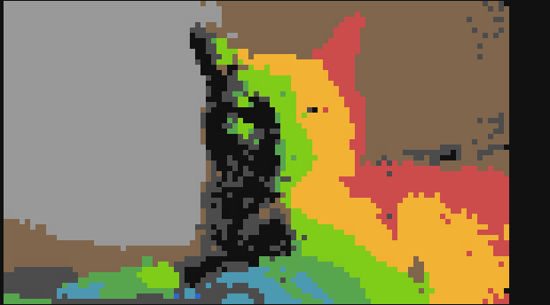

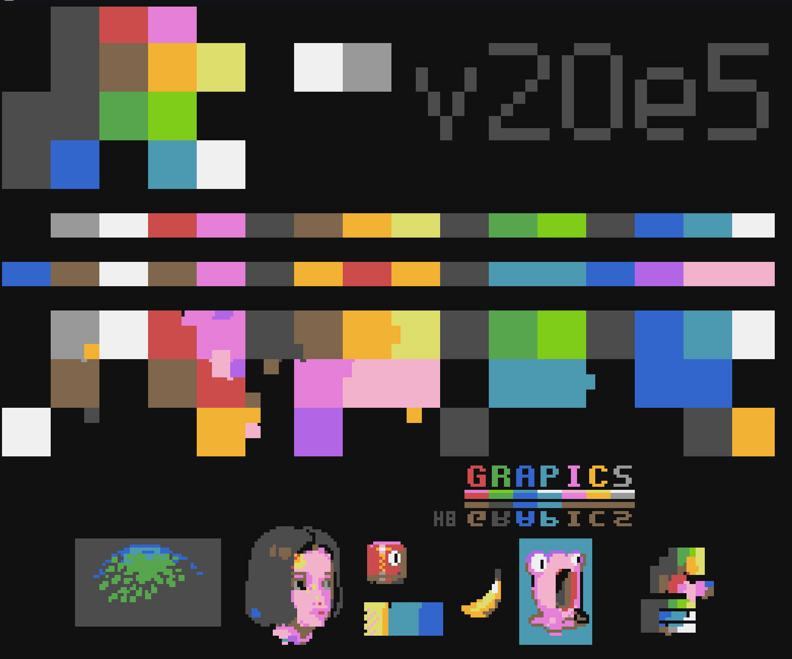

---
Test
**Meow :3**
https://devvie.cc